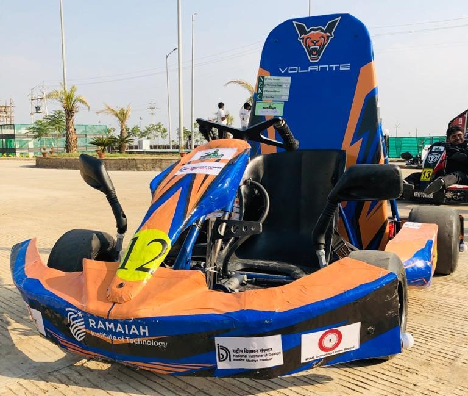
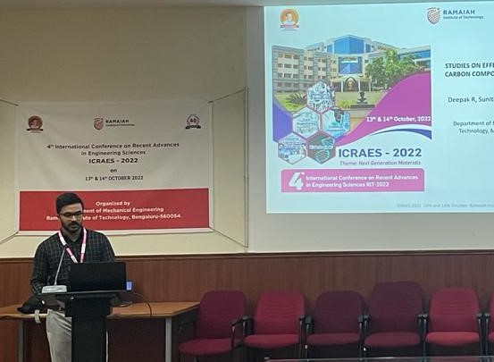
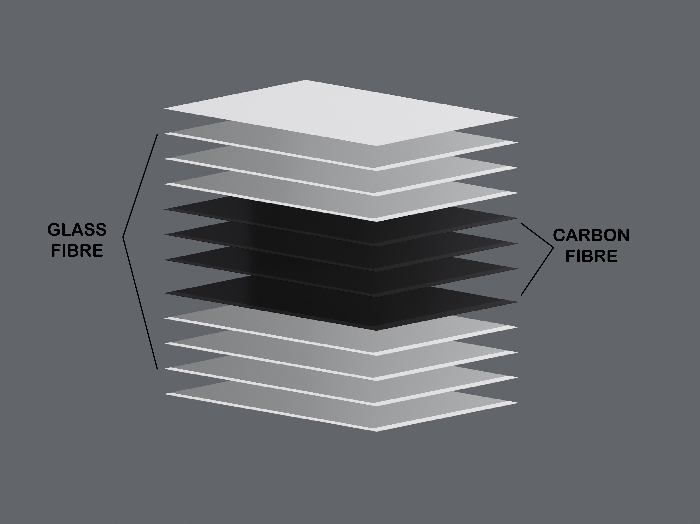

 <h1 align="center"> DEEPAK RAMESH</h1>

Hi! I am a passionate mechanical engineer and aspiring roboticist with hands-on experience working in startups and projects, currently persuing MS Robotics at Northeastern University. Areas of interest include Control Systems, SLAM, Computer Vision and Reinforcement Learning. 

Working for 18 months at Strider Robotics, I learnt the entire product-development cycle from a reasearch prototye to a market ready product. I was able to solve real world problems by leveraging my skills in CAD modelling, Linear and non-linear FEA, Multi-body dynamic analysis, Design for Assembly & Manufacturing and drafting engineering drawings using GD&T. 

---

## 📚 Table of Contents
- [Projects](#projects)
- [Research Experience](#research)
- [Professional Experience](#experience)
- [Publications](#publications)
- [Contact](#contact)

---
## 🛠️ Research Experience

## HARPY - A thrust assisited bipedal robot

https://github.com/user-attachments/assets/0e37490c-4a58-40f7-87bb-263350ca5c5a

---

## 🛠️ Projects

### [6D Pose estimation using RGB Camera](data/Projects/DOPE/Readme.md) 

https://github.com/user-attachments/assets/735b7227-9c3b-416b-b3b8-5634fb23791b

- Developed a real-time 6-DoF object pose estimation system by training a multi-stage Convolutional Neural Network with VGG-19 backbone  in PyTorch to predict belief and affinity maps integrating OpenCV’s EPnP + RANSAC for accurate pose recovery
- Generated 40K+ synthetic RGB images using BlenderProc and designed data pre/post-processing pipelines, enabling zero-shot sim-to-real inference at 15–20 FPS on consumer-grade GPUs
- Achieved 92% ADD accuracy and strong real-world generalization, evaluated with KPD/AUC metrics, supporting robotic perception and vision-based planning tasks

### [Time optimal trajectory planning for a UAV](data/Projects/UAV/Readme.md)

  
  

- Developed an autonomous flight stack for an UAV using A* as a global planner and a MIQP based receding horizon local planner solved using the Gurobi C++ API to obtain a time optimal path achieving 20% faster trajectories than conventional QP methods
- Developed the entire stack in ROS2 C++ integrating LIDAR based SLAM to develop real-time costmaps and obtain convex collision-free corridors for the MIQP planner and validated in Gazebo simulation environment

### [Reinforcement Learning Policy for Autonomous Racing](data/Projects/F1tenth/Readme.md)

	<video src="https://github.com/user-attachments/assets/35e1bfc0-d423-4540-aadc-89d99478a256" width="70%" controls>
	</video>

- Developed a full autonomous racing pipeline for a 1/10th-scale autonomous racecar, implemented a Model Predictive Contouring Control (MPCC) in ROS2 C++ to follow a precomputed raceline deployed on an Intel NUC-ANHi5 for real-time control 
- Developed a Soft Actor Critic (SAC) policy in PyTorch with Stable-Baselines3, incorporating reward shaping to improve lap times by 15% over baseline controllers in both simulation and hardware experiments
- Integrated Hokuyo 2D LiDAR scans with wheel-encoder odometry via Adaptive Monte Carlo Localization to output a fused 2D pose to the controller, improving robustness to slip and ensuring reliable high-speed lap tracking across track layouts

### [Electric All Terrain Vehicle](data/Projects/BAJA/Readme.md)

	

Captain of [Team Volante](https://www.instagram.com/team_volante/?hl=en), a collegite club consisting of 40 students, focused on building electric all-terrain vehicles for student motorsport competitions. Being the first team in India to sucessfully integrate 4 hub motors in an all-wheel drive electric ATV, we secured 2nd   runner-up position at MEGA ATV Competition 2022.  

---

### [Electric GoKart ](link-to-project-2-readme)

	

Mechanical Design Lead of [Team Volante](https://www.instagram.com/team_volante/?hl=en). Developed an electric go-kart with a team of 19 to participate in National Electric Karting Championship 2020. Secured 6th   place in the competition.

---
## 💼 Professional Experience

### [Strider Robotics]()

	

Strider Robotics is India's first quadruped robotics startup incubated under AI and Robotics Tech Park (ARTPARK) at Indian Institue of Science (IISc), Bangalore, India. Primary focus of the company is the develop robust legged robots that can navigate challenging terrains.

---
## 📄Publications

### [Studies on effect of loading rates on hybrid composites]()

 

 
 [🔗Publication link](https://www.informaticsjournals.com/index.php/jmmf/article/view/33355)
Reasearched about the strength of Carbon/Glass fiber hybrid composites particulary in the open-hole tensile test under the guidance of Prof.Sunith Babu. Presented the findings in International Conference on Applied Research in Engineering Sciences 2022. 

---

## 📞 Contact
I’d love to hear from you! Feel free to reach out for questions or collaboration opportunities.

- **Email**: [ramesh.deep@northeastern.edu](mailto:yourname@example.com)
- **LinkedIn**: [Deepak Ramesh](www.linkedin.com/in/deepak-ramesh-5857861a5)
- **GitHub**: [Deepak Ramesh](https://github.com/deepakr2210)

---

