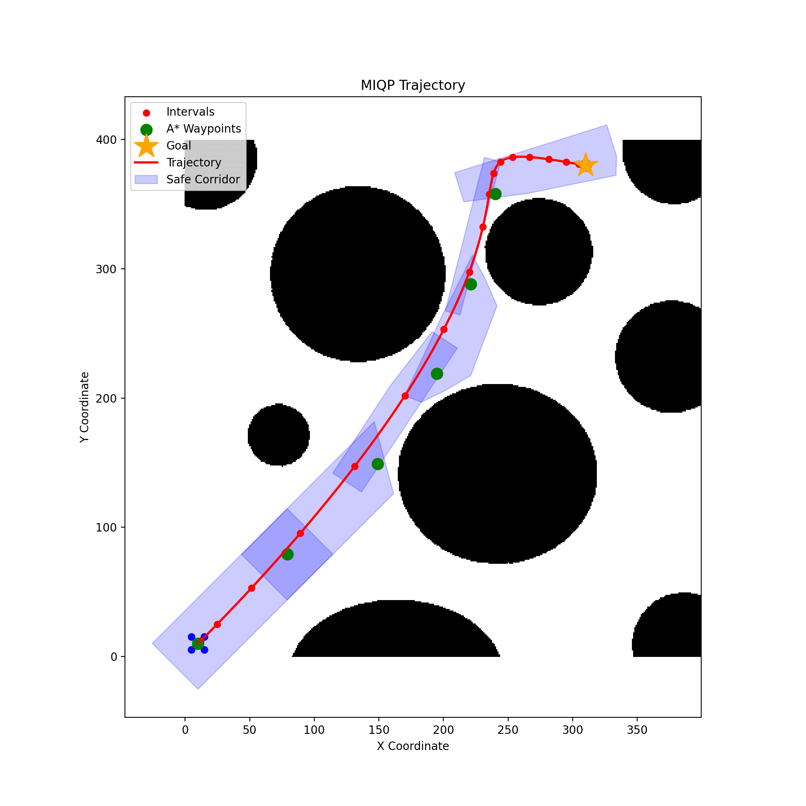

 <h1 align="center"> DEEPAK RAMESH</h1>

Hi! I'm a Robotics engineer passionate about building reliable, high-performance systems that bridge mechanics, electronics, and control. From autonomous drones to bipedal robots, I focus on designing, prototyping, and testing solutions that work seamlessly in the real world. 

 Areas of interest include Control Systems, SLAM, Computer Vision and Reinforcement Learning. 

Working for 18 months at Strider Robotics, I learnt the entire product-development cycle from a reasearch prototye to a market ready product. I was able to solve real world problems by leveraging my skills in CAD modelling, Linear and non-linear FEA, Multi-body dynamic analysis, Design for Assembly & Manufacturing and drafting engineering drawings using GD&T. 

---
[RESUME](data/Deepak_resume.pdf)
---

## 📚 Table of Contents
- [Projects](#projects)
- [Research Experience](#research)
- [Professional Experience](#experience)
- [Publications](#publications)
- [Contact](#contact)

---
## 🛠️ Research Experience

## HARPY - A thrust assisited bipedal robot

	<video src="https://github.com/user-attachments/assets/0e37490c-4a58-40f7-87bb-263350ca5c5a" width="70%" controls>
	</video>

Working as a Research Assistant at [Silicon Synapse Lab](https://siliconsynapse.sites.northeastern.edu/) on a thrust assisted bipedal robot call HARPY! Working towards a thesis on developing a Whole Body Controller for multi-modal behaviours under the guidance of [Dr.Alireza Ramezani](https://coe.northeastern.edu/people/ramezani-alireza/)

---

## 🛠️ Projects

### [6D Pose estimation using RGB Camera](data/Projects/DOPE/Readme.md) 

	<video src="https://github.com/user-attachments/assets/735b7227-9c3b-416b-b3b8-5634fb23791b" width="80%" controls>
	</video>

Developed a real-time 6-DoF object pose estimation system that uses RGB data running inference at 30 FPS on consumer grade GPUs. Trained a multi-stage Convolutional Neural Network in PyTorch with synthetically generated images and annotated datasets such as [YCB-Benchmarks](https://www.ycbbenchmarks.com/) to achieve 92% accuracy.

### [Time optimal trajectory planning for a UAV](data/Projects/UAV/Readme.md)

<!-- 

	<video src="https://github.com/user-attachments/assets/c1cde727-ff6d-448a-8fb1-ca5b24389beb" width="80%" controls>
	</video>

 -->

	<video src="https://github.com/user-attachments/assets/c1cde727-ff6d-448a-8fb1-ca5b24389beb" width="20%" controls>
	</video>
  <!--  -->
  

Developed an autonomous flight stack for an UAV to traverse in unkown terrain with a limited perception window. Formulating the trajectory optimizer as a MIQP gives a unique advantage of faster trajectories than conventional QP methods.

### [Reinforcement Learning Policy for Autonomous Racing](data/Projects/F1tenth/Readme.md)

<!-- https://github.com/user-attachments/assets/35e1bfc0-d423-4540-aadc-89d99478a256 -->

	<video src="https://github.com/user-attachments/assets/a2f2f59b-9123-4e85-a76c-d10a30bb94e7" width="70%" controls>
	</video>

Developed a full autonomous racing pipeline for a 1/10th-scale autonomous racecar. Implemented control solutions such as MPCC, MPC, MPPI etc and also data driven mrthods such as SAC, PPO etc for real-time decision making on an Intel NUC. Implemented sensor fusion of LiDAR and odometry for localization and mapping to enable robust, real-time state estimation under dynamic race conditions

### [Electric All Terrain Vehicle](data/Projects/BAJA/Readme.md)

	

Captain of [Team Volante](https://www.instagram.com/team_volante/?hl=en), a collegite club consisting of 40 students, focused on building electric all-terrain vehicles for student motorsport competitions. Being the first team in India to sucessfully integrate 4 hub motors in an all-wheel drive electric ATV, we secured 2nd   runner-up position at MEGA ATV Competition 2022.  

---

### [Electric GoKart ](link-to-project-2-readme)

	

Mechanical Design Lead of [Team Volante](https://www.instagram.com/team_volante/?hl=en). Developed an electric go-kart with a team of 19 to participate in National Electric Karting Championship 2020. Secured 6th   place in the competition.

---
## 💼 Professional Experience

### [Strider Robotics]()

	

Strider Robotics is India's first quadruped robotics startup incubated under AI and Robotics Tech Park (ARTPARK) at Indian Institue of Science (IISc), Bangalore, India. Primary focus of the company is the develop robust legged robots that can navigate challenging terrains.

---
## 📄Publications

### [Studies on effect of loading rates on hybrid composites]()

 

 
 [🔗Publication link](https://www.informaticsjournals.com/index.php/jmmf/article/view/33355)
Reasearched about the strength of Carbon/Glass fiber hybrid composites particulary in the open-hole tensile test under the guidance of Prof.Sunith Babu. Presented the findings in International Conference on Applied Research in Engineering Sciences 2022. 

---

## 📞 Contact
I’d love to hear from you! Feel free to reach out for questions or collaboration opportunities.

- **Email**: [ramesh.deep@northeastern.edu](mailto:yourname@example.com)
- **LinkedIn**: [Deepak Ramesh](www.linkedin.com/in/deepak-ramesh-5857861a5)
- **GitHub**: [Deepak Ramesh](https://github.com/deepakr2210)

---

