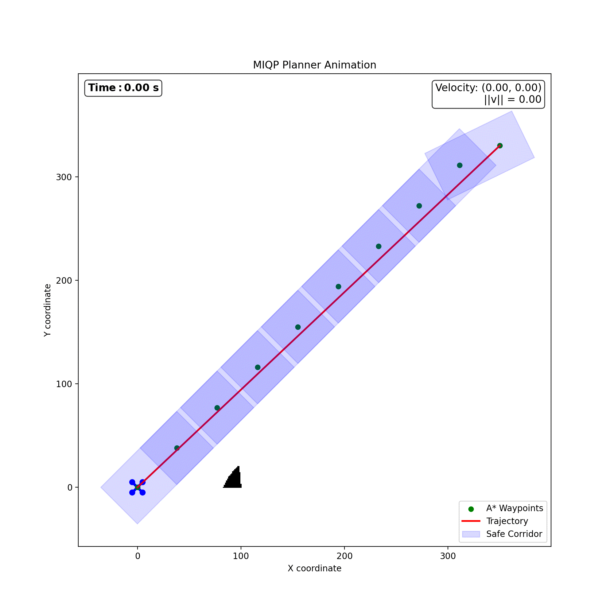

[Back to Main Page](../../../README.md)

# FASTER

This is an implementation of [FASTER (Fast and Safe Trajectory Planner)](https://ieeexplore.ieee.org/document/9932432), originally developed for high-speed UAV navigation in 3D unknown environments. The original work uses advanced Mixed-Integer Quadratic Programming (MIQP) to generate dynamically feasible and safe trajectories.


## 📘 Original Work

**FASTER** was introduced by Tordesillas *et al.* in the following paper:

> J. Tordesillas, B. T. Lopez, and J. P. How,  
> “FASTER: Fast and Safe Trajectory Planner for Flights in Unknown Environments,” 
> *IEEE Transactions on Robotics*, vol. 39, no. 2, pp. 1113–1132, Apr. 2023.  
> [DOI: 10.1109/TRO.2022.3204555](https://doi.org/10.1109/TRO.2022.3204555)


## 🔧 My Implementation
<table>
  <tr>
    <td></td>
    <td></td>
  </tr>
  <tr>
    <td align="center"><b>QP Replanner</b></td>
    <td align="center"><b>MIQP Replanner</b></td>
  </tr>
</table>

This project adapts the core concepts of FASTER to a **Gazebo Simulation environment**, where the robot navigates a known or incrementally revealed occupancy grid. Key components:

- **Global planner**: A* algorithm for coarse path generation.
- **Convex decomposition**: Uses [DecompUtil](https://github.com/sikang/DecompUtil) to create convex corridors around the path.
- **Triple integrator dynamics** : Simplified model used for smooth, efficient trajectory planning while capturing key motion constraints.
- **Trajectory optimization**:
  - QP (Quadratic Program) for fixed-interval smooth trajectories.
  - MIQP (Mixed-Integer Quadratic Program) for optimal interval allocation.
- **Bézier control points** to ensure the full trajectory remains within convex corridors.
- **Replanning** support to mimic online replanning behavior with a perception radius.


## Single trajectory generation
<table>
  <tr>
    <td></td>
    <td></td>
  </tr>
  <tr>
    <td align="center"><b>QP Trajectory</b></td>
    <td align="center"><b>MIQP Trajectory</b></td>
  </tr>
</table>


Given a start and a goal location the above scripts will generate a QP and MIQP trajectories, displaying an animation of trajectory execution. 


## 📜 Citation

If you use this codebase or ideas, please cite the original paper:

```bibtex
@article{tordesillas2023faster,
  author    = {J. Tordesillas and B. T. Lopez and J. P. How},
  title     = {{FASTER: Fast and Safe Trajectory Planner for Flights in Unknown Environments}},
  journal   = {IEEE Transactions on Robotics},
  volume    = {39},
  number    = {2},
  pages     = {1113--1132},
  year      = {2023},
  doi       = {10.1109/TRO.2022.3204555}
}
```

##  Acknowledgements

This project was developed under the guidance of Prof. Michael Everett. I sincerely thank him for his constant support, availability, and thoughtful insights throughout this work.


[Back to Main Page](../../../README.md)